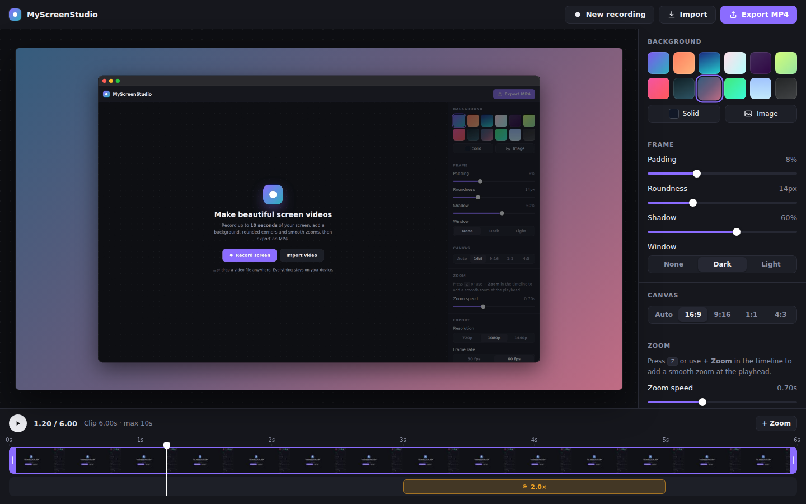

# MyScreenStudio

A free, open-source screen recorder that turns short clips into polished videos. You get backgrounds, rounded corners, shadows, smooth zooms, and **MP4 export**, all running **100% in your browser**. Nothing is uploaded anywhere.

> Inspired by [Screen Studio](https://screen.studio/). This is an independent project and isn't affiliated with it.



## Features

- 🎥 **Screen recording** of a screen, window, or tab, with the cursor visible. Recording **auto-stops at 10 seconds**.
- ⬚ **Record just part of your screen**: after choosing a screen, draw the area you want (free, 16:9, 9:16, 1:1, or 4:3). A 3-second countdown gives you time to switch windows. You can re-crop any time afterward with **Crop**.
- 📂 **Import** any video (drag & drop works too). Longer clips get trimmed to a 10s window you can move around.
- 🎨 **Backgrounds**: 12 gradient presets, a solid color, or your own image. Or choose **No background** to export the recording itself, edge to edge.
- 🪟 **Frame styling**: padding, corner roundness, drop shadow, and an optional macOS-style window bar (dark or light).
- 📐 **Aspect ratios**: Auto, 16:9, 9:16 (Reels/TikTok/Shorts), 1:1, and 4:3.
- 🔍 **Smooth zooms**: add zoom segments on the timeline, set the zoom level and speed, and drag the focus point anywhere, either in the sidebar or directly on the big preview. Turn on **Pan to a second point** and the camera glides from point A to point B while zoomed in.
- ✂️ **Trim** with the purple handles on the timeline (0.5s to 10s).
- 📦 **MP4 export** (H.264) at 720p, 1080p, or 1440p, 30 or 60 fps. Every frame is rendered accurately and encoded with the browser's native WebCodecs API.
- 🔒 **Private**: no server, no account, no watermark.

## Keyboard shortcuts

| Key | Action |
| --- | --- |
| `Space` | Play / pause |
| `Z` | Add a zoom at the playhead |
| `Delete` / `Backspace` | Delete the selected zoom |
| `←` / `→` | Step one frame |
| `Esc` | Deselect the zoom / cancel area selection |
| `Enter` | Confirm the area selection |

## How to use

1. Click **Record screen** and choose what to share. Draw the area you want to record (or keep **Full screen**), then click **Start recording**. After a 3-second countdown, recording starts. It stops automatically after 10 seconds, or you can click **Stop**.
2. Pick a background and adjust the frame (padding, roundness, shadow, window style), or choose **No background**.
3. To zoom, click on the **zoom track** (the row below the video) or press `Z`. Then drag the focus point, either in the small sidebar preview or directly on the big preview, to choose where it zooms. Turn on **Pan to a second point** to move from A to B during the zoom. Drag the zoom block to move it, or drag its edges to resize it.
4. Click **Export MP4**. Keep the tab visible while it renders, which takes about as long as the clip. Then download your video.

## Run it locally

It's plain HTML, CSS, and JavaScript with **no build step and no dependencies**. Because it uses ES modules, it needs to be served over HTTP (opening `index.html` directly with `file://` won't work):

```bash
# Option A: Python (preinstalled on macOS / Linux)
python3 -m http.server 8080

# Option B: Node
npx serve .
```

Then open <http://localhost:8080>.

## Deploy for free with GitHub Pages

1. Create a new repository on GitHub and push this folder:
   ```bash
   git init
   git add .
   git commit -m "MyScreenStudio"
   git branch -M main
   git remote add origin https://github.com/<your-username>/myscreenstudio.git
   git push -u origin main
   ```
2. In the repository, go to **Settings → Pages**.
3. Under **Build and deployment**, choose **Deploy from a branch**, then select **main** and **/ (root)**, and save.
4. After a minute your app will be live at `https://<your-username>.github.io/myscreenstudio/`.

GitHub Pages serves over HTTPS, which screen recording requires.

## Browser support

| | Record | Export MP4 |
| --- | --- | --- |
| Chrome / Edge (desktop) | ✅ | ✅ |
| Safari 17+ (macOS) | ✅ | ✅ |
| Firefox 130+ (desktop) | ✅ | ⚠️ depends on the OS H.264 encoder |
| Mobile browsers | ❌ (no screen capture) | ✅ with imported videos |

## Project structure

```
index.html          App layout
css/styles.css      Styles (dark UI)
js/app.js           Editor: state, recording, timeline, sidebar, export flow
js/renderer.js      Draws each frame: background, frame, shadow, window bar, zoom camera
js/exporter.js      Renders every output frame and encodes H.264 with WebCodecs
js/mp4-muxer.js     Tiny dependency-free MP4 (ISO BMFF) writer
```

### How export works

1. The trimmed clip plays in a hidden `<video>` element.
2. For each output frame (for example 600 frames for 10s at 60 fps), `renderScene()` draws the full composition onto a canvas at the export resolution.
3. The canvas becomes a `VideoFrame` and is encoded by `VideoEncoder` (H.264 High profile).
4. `mp4-muxer.js` wraps the encoded samples in a fast-start `.mp4` file.

Playback speed adapts to your machine, so frames always stay in sync with the source, even on slower computers.

## Limitations & ideas

- No audio yet. Videos are exported silent.
- Cursor effects (smooth cursor, click highlights, auto-zoom on clicks) aren't possible from a browser tab, because the browser doesn't expose cursor positions outside the page.
- Ideas for contributions: webcam overlay, GIF export, motion blur, custom gradient editor, and saving/loading projects.

## License

[MIT](LICENSE)
